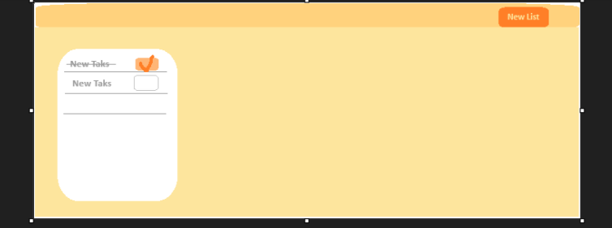

# Projeto TodoApp

Uma **TodoApp** é nada mais nada menos do que um aplicativo online que armazena uma lista de coisas a fazer e salva em algum lugar, basicamente se olharmos para um caderno físico ele possui folhas e nessas folhas podemos definir como será feito a organização dos itens dessa lista, mas o mais interessante é que o caderno armazena essa lista e não desaparece ou seja fica guardado para sempre no caderno. Usando essa mesma lógica vamos criar um **TodoApp** online que permite ao usuário criar uma lista, adicionar itens e, marcar como concluída, o usuario tambem pode eliminar a lista e ver um historico das listas com suas tarefas que foram concluidas. Para permitir que os dados das listas sejam armazenadas mesmo que o usuario rode o navegador vamos usar o LocalStorage.

## Funcionalidades Principais
- Criar, Editar e eliminar uma Lista
- Adicionar itens a Lista
- Marcar como concluída uma tarefa da lista
- Ver histórico de tarefas concluídas
- Criar, Editar e eliminar uma Lista
- Outras funcionalidades seram adicionadas a posterior!

## Fluxo de tarefa principal
- Usuario acessa o index pela URL
- Clica no botao criar lista e um evento e disparado
- Na folha aparece um campo de input criado 
- O Usuario escreve a tarefa no campo e o sistema guarda num array 
- Aparece as opcoes de Editar e eliminar a tarefa ou marcar como concluida
- Outras funcionalidades seram adicionadas a posterior!

## Esboço simples da tela

 Essa imagem bem fusca é simplesmente uma demonstração de como a interface final será desenvolvida o objectivo é ter uma visão geral de como as coisas serão implementadas

## Tecnologias implementadas

  

